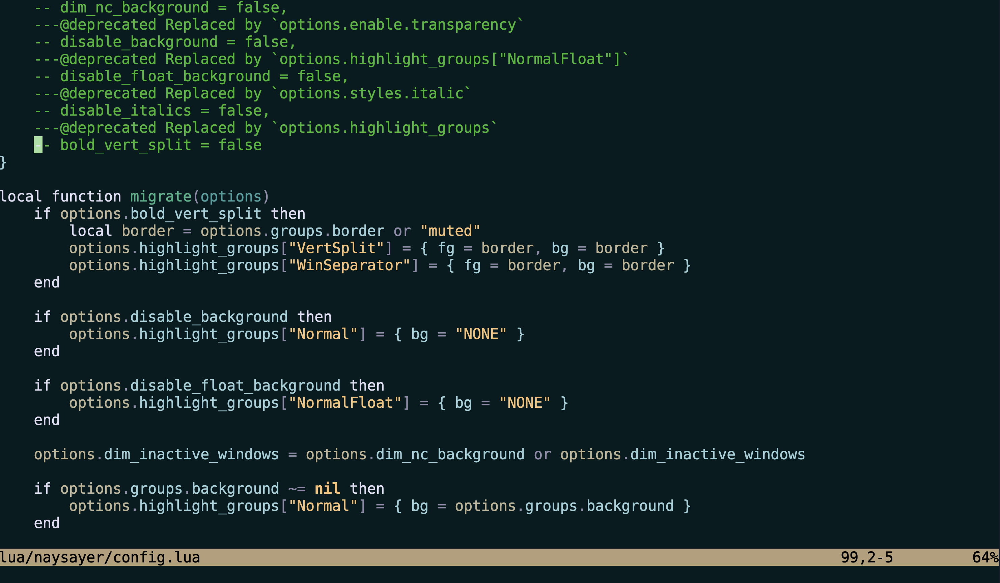

# naysayer88 theme
<h1>
    
</h1>

## Using `packer`
```lua
use ({'alljokecake/naysayer-theme.nvim', as = 'naysayer'})
```
## Setup
```lua
require('naysayer').setup({
	variant = 'main',
	dark_variant = 'main',
	bold_vert_split = false,
	dim_nc_background = false,
	disable_background = true,
	disable_float_background = true,
	disable_italics = true,
})

vim.cmd("colorscheme naysayer")
```
